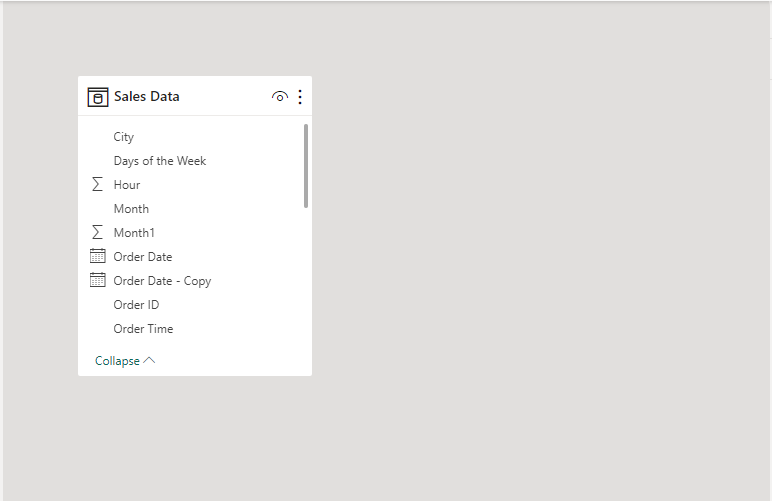
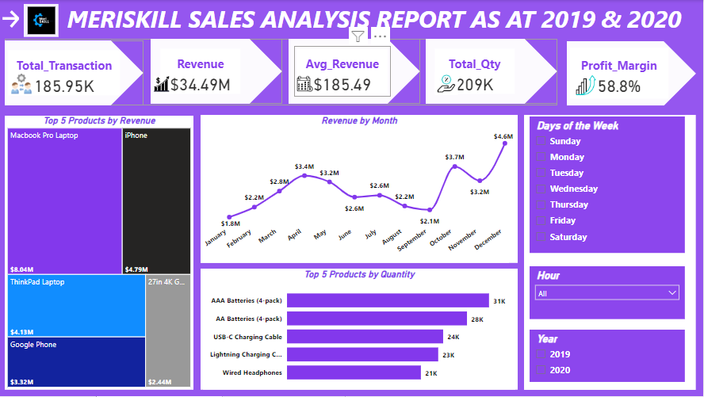
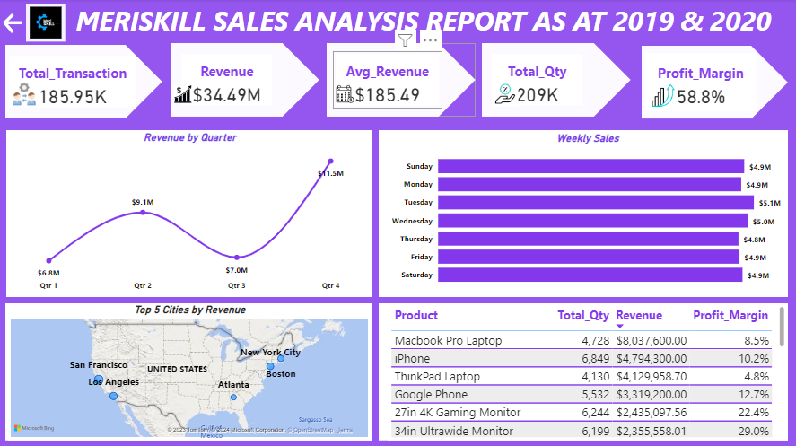

# Sales Analysis-Report in Power BI

 

## Introduction
---
This sales analysis report in Power BI represents a dynamic and comprehensive analysis of critical performance metrics, providing stakeholders with a visualized understanding of sales dynamics.

## Problem Statement
1. Which product generate the highest revenue?
2. which country generate the hightest revenue?
3. what is the best performing day?
4. What product have the highest order?

## Skills/ Concepts Demostrated
The following power BI features was incorporated:
- Data Cleaning
- Data Transformation
- Dax 
- Page Navigation
- Button
- Filters

## Modelling
The model is a star schema and it contain only one dimensional table.

## Visualization
The report comprises of two pages

you can interact with the report [here](https://app.powerbi.com/view?r=eyJrIjoiYzNmMGZjYmEtODRhOS00NDU2LWIxYmQtYjg3MzY3NmE2YTZjIiwidCI6ImNmYTI1N2FmLTk1N2EtNDU3Ny05MWIyLTU4ZjYwMDgzZmYyZSJ9)

Image of the Analysis                  

Continaution of the Analysis

